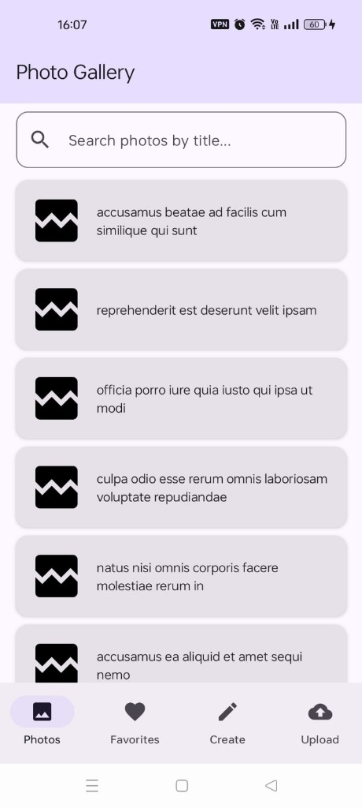
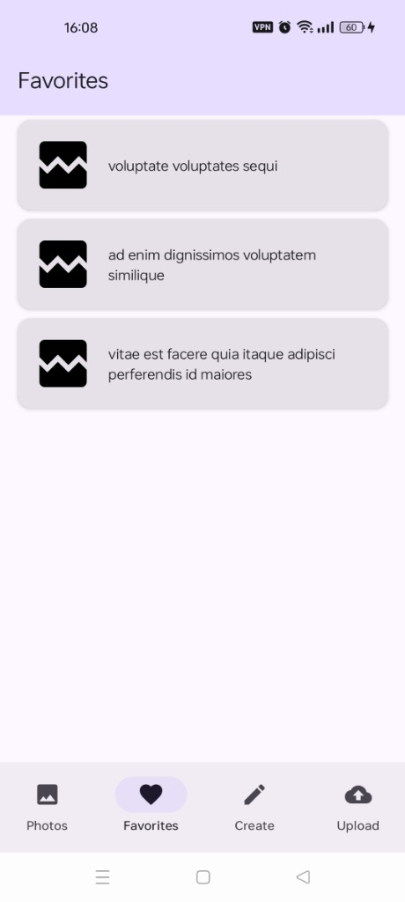
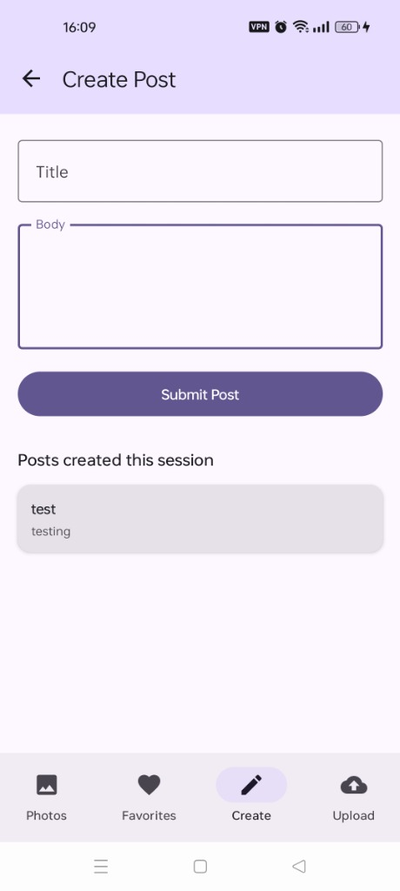
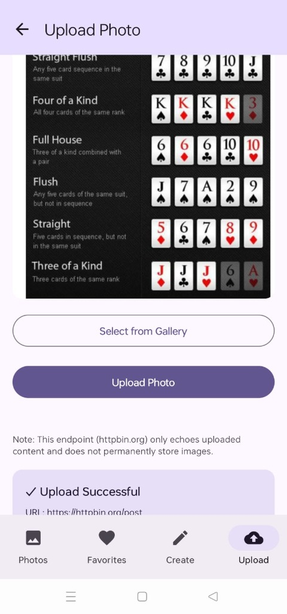
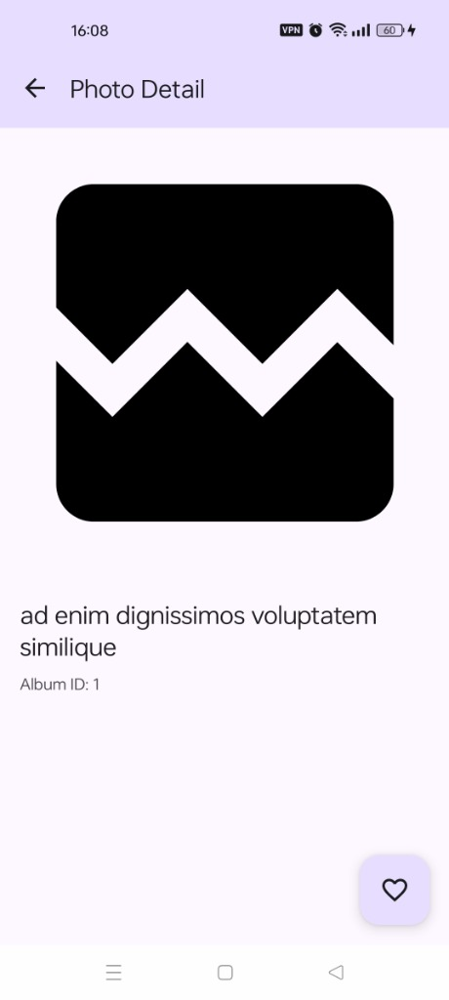

# Photo Gallery

A complete Android application demonstrating **Clean Architecture + MVVM** built as an interview coding assignment. The app fetches photos from a public API, allows favoriting with local persistence, creates posts, and uploads images.

---

## Architecture Decisions

### Why MVVM?
Model-View-ViewModel cleanly separates the UI (Compose) from the business logic. It handles Android configuration changes natively, makes state management predictable, and allows ViewModels to be unit tested without requiring Android framework dependencies.

### Why Clean Architecture?
It enforces strict separation of concerns into Domain, Data, and Presentation layers. The Domain layer is pure Kotlin, making the core business logic entirely independent of UI frameworks, network libraries, or databases. This ensures high testability, maintainability, and scalability.

### Why Repository Pattern?
The Repository acts as a single source of truth for data. It abstracts away whether data comes from the network (Retrofit) or local database (Room). The Domain layer simply requests data via an interface, keeping it decoupled from the data source implementations.

### Why StateFlow?
`StateFlow` is a modern, coroutine-native alternative to `LiveData`. It is strictly typed, works natively with Kotlin Coroutines, has no hidden lifecycle dependencies, and seamlessly integrates with Jetpack Compose using `collectAsState()`.

### Why Room?
Room provides a robust abstraction layer over SQLite. It offers compile-time verification of SQL queries, seamless integration with Coroutines for asynchronous database operations, and prevents boilerplate code.

### Why Hilt?
Hilt is the standard Dependency Injection library for Android. It eliminates manual boilerplate, manages the lifecycles of dependencies automatically, and integrates perfectly with Jetpack Compose and ViewModels.

---

## Features Implemented

### Photo List
- Fetches 5000 photos from JSONPlaceholder.
- Displays thumbnail + title in a `LazyColumn`.
- Optimized in-memory repository cache for instant re-loads.
- Responsive Search with a 300ms debounce running on background threads.
- Robust Loading / Error / Success states with a Retry mechanism.

### Photo Detail
- Opens instantly in O(1) time using the repository's memory cache.
- Shows full-size image and title.
- Floating Action Button to toggle favorite.
- Favorite state **persists across app restarts** via Room database.

### Create Post
- POST to JSONPlaceholder.
- Title and Body fields with validation.
- All posts created during the session are shown in a list below the form.

### Photo Upload
- Native gallery picker using `ActivityResultContracts.GetContent`.
- Preview of selected image.
- Multipart upload to `httpbin.org`.
- Displays response summary (URL, content type, size).

---

## Known Limitations & Trade-offs

1. **via.placeholder.com Domain Retirement**: JSONPlaceholder currently returns image URLs hosted on `via.placeholder.com`. Depending on network and regional availability, image retrieval may fail (the domain has been retired). The application gracefully handles this through loading and error placeholders to ensure no blank spaces appear in the UI.
2. **API returns 5000 photos**: To keep the app simple and focused on architecture, all 5000 items are fetched at once. They are cached in-memory inside the Repository to prevent blocking the UI, but a production app would use Paging.
3. **Session-Only Post Persistence**: Created posts are not actually saved on the remote server (JSONPlaceholder is a mock API). Because of this, the app stores them in-memory for the current session only. They do not persist across app restarts.
4. **httpbin.org upload endpoint**: This endpoint simply echoes the uploaded content back. It does **not permanently store images**.
5. **httpbin.org Upload Failures (HTTP 503)**: Since `httpbin.org` is a free, shared public testing service, it is subject to rate-limiting, transient load spikes, and payload size limitations. If an image upload fails with an HTTP 503 error, it is due to these temporary server-side constraints. The application handles this gracefully by notifying the user via a Toast.

---

## Future Improvements

- **Paging 3**: Implement the Paging3 library to paginate the 5000 photos instead of loading them into memory all at once.
- **Offline photo caching**: Store the fetched network photos in Room for fully offline browsing.
- **UI tests**: Add Compose UI tests using `ComposeTestRule` to verify user flows programmatically.
- **Better retry strategy**: Implement exponential backoff for network requests using an OkHttp Interceptor.
- **Image prefetching**: Preload Coil images in the `LazyColumn` before they scroll into view.

---

## Libraries Used

| Library | Purpose |
|---|---|
| Jetpack Compose | Declarative UI toolkit |
| Hilt | Dependency injection |
| Retrofit + Gson | REST API networking |
| Room | Local SQLite database for favorites |
| Coil | Image loading and caching |
| Navigation Compose | Type-safe screen navigation |
| Coroutines & Flow | Asynchronous operations |
| JUnit + Mockito | Unit testing |

---

## Setup Instructions

1. **Clone the repository**:
   ```bash
   git clone https://github.com/aravind-p-developer/PhotoGalleryApp.git
   cd PhotoGalleryApp
   ```
2. **Open in Android Studio**:
   - Open Android Studio (Ladybug 2024.2.1 or newer).
   - Select **Open an Existing Project** and choose the root directory of the cloned repository.
3. **Configure SDK**:
   - Ensure you have JDK 17 configured in Android Studio Gradle settings (`Settings > Build, Execution, Deployment > Build Tools > Gradle`).
4. **Build and Run**:
   - Press the green **Run** button to deploy the app to an emulator or physical device.
   - Or compile debug packages via the CLI:
     ```bash
     ./gradlew assembleDebug
     ```
5. **Run Tests**:
   - Run unit tests from the CLI:
     ```bash
     ./gradlew testDebugUnitTest
     ```

---

## Screenshots

Below are screenshots of the key application flows:

### Home Screen



### Favorites Screen



### Create Post Screen



### Upload Screen



### Photo Detail Screen


